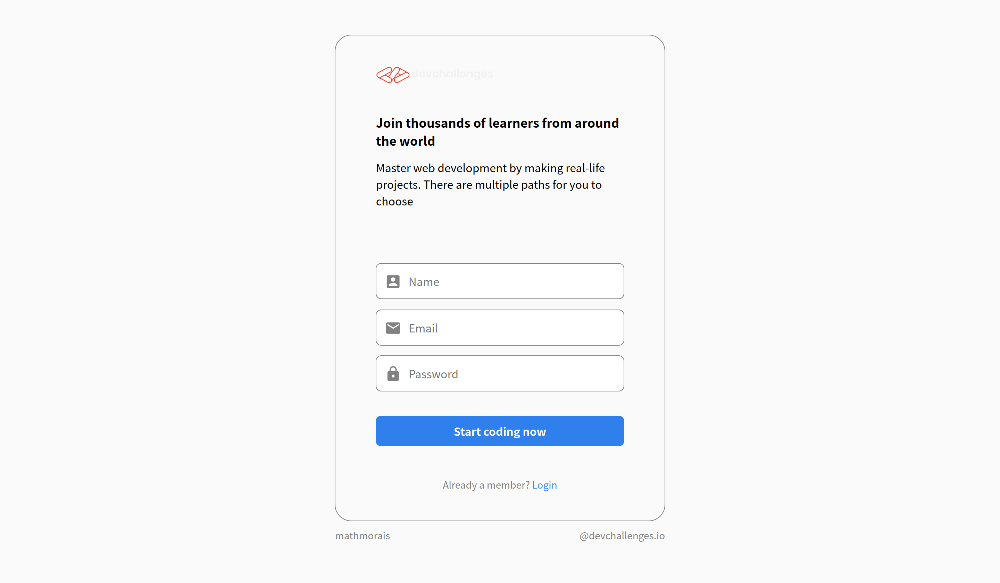
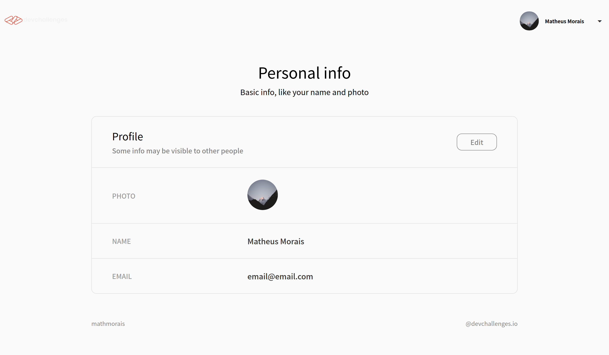
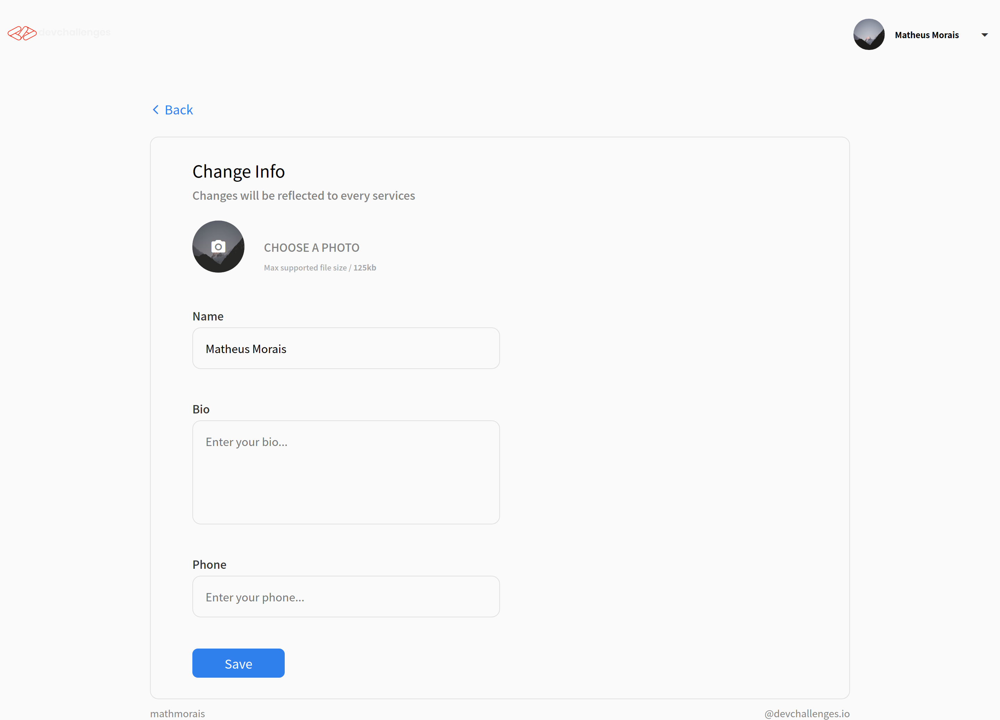

<div align="center">
  <h2>Auth app</h2>
</div>

#

<div align="center">
   Solution for a challenge from  <a href="http://devchallenges.io" target="_blank">Devchallenges.io</a>.
</div>

<div align="center">
  <h3>
    <a href="https://devchallenges.io/challenges/N1fvBjQfhlkctmwj1tnw">
      Challenge
    </a>
  </h3>
</div>

<div align="center">


</div>

## Table of Contents

- [Overview](#overview)
  - [About](#about)
  - [Tecnologies used](#technologies)
- [How to use](#how-to-use)
- [Contact](#contact)

## Overview

#### Register page



#### Profile page



#### Edit page



### About

This project is a authentication page to register, login and edit a profile.

In the profile page you can see your photo, name, bio and email. You can edit that field in the edit page.

The Server-side was created using [nodejs](https://nodejs.org/) and [express](https://prettier.io/). for authention i use [jsonwebtoken](https://jwt.io/) and the database [mongodb](https://www.mongodb.com/). To encrypt the passwords i used [bcrypt](https://www.npmjs.com/package/bcrypt).

I've learned a lot about authentication in this project,
I recommend you try to recreate too :)

### Technologies

- [NextJS](https://nextjs.org/)
- [NodeJS](https://nodejs.org/)
- [Express](https://prettier.io/)
- [JWT](https://jwt.io/)
- [Axios](https://github.com/axios/axios)
- [MongoDB](https://www.mongodb.com/)
- [Mongoose](https://mongoosejs.com/)
- [Bcryptjs](https://eslint.org/)

## How To Use

To clone and run this application, you'll need [Git](https://git-scm.com) and [Node.js](https://nodejs.org/en/download/) (which comes with [npm](http://npmjs.com)) installed on your computer. From your command line:

```bash
# Clone this repository
$ git clone https://github.com/mathmorais/authapp

# Enter in the root folder
$ cd authapp

# Install dependencies, will generate a build too in the postisntall
$ npm install

# Run the client-side and the server-side of the site
$ npm run app

```

#### After that the client will be running on the http://localhost:3000

## Contact

- GitHub [@mathmorais](https://github.com/mathmorais)
- Email [gm80648@gmail.com](mailto:gm80648@gmail.com)
